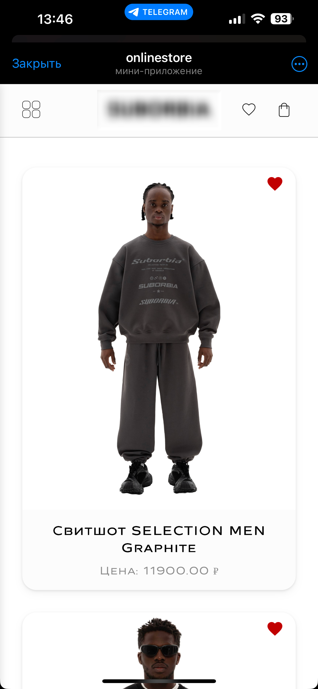
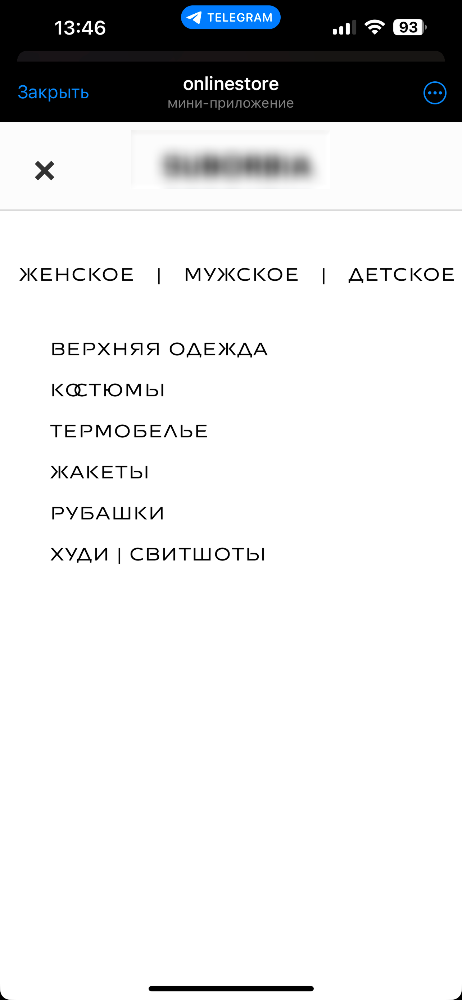
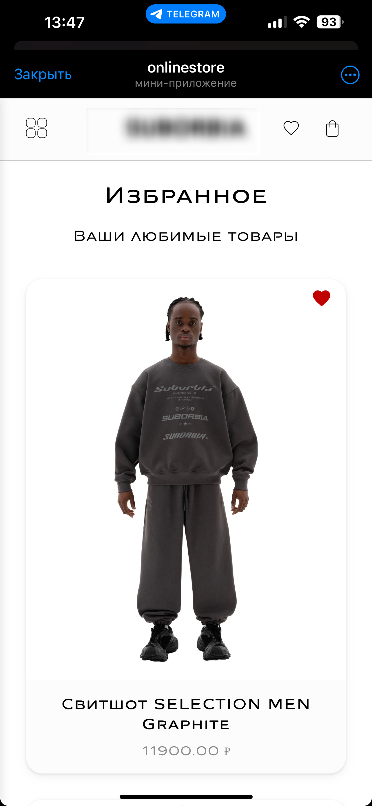
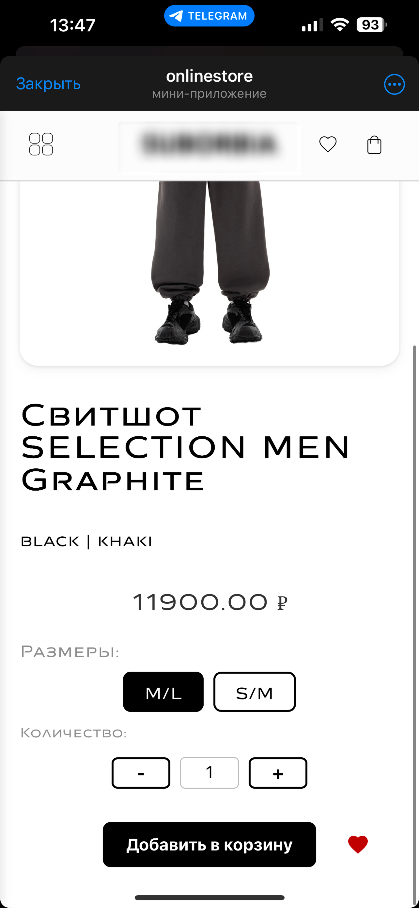
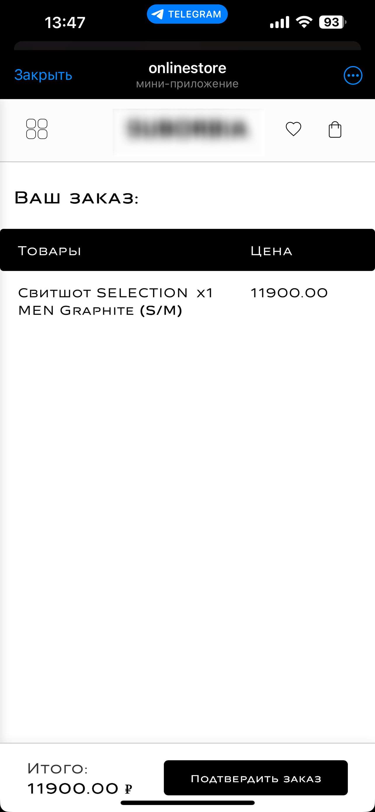

# 🛍️ Telegram Shop

**Онлайн-магазин с Telegram-ботом и Django MiniApp**  
Полноценное ecommerce-решение, включающее:
- Telegram-бот на `aiogram 3`
- Мини-приложение (MiniApp) на `Django`, интегрированное в Telegram через WebApp
- Поддержка онлайн-оплаты, уведомлений и аналитики

---

## 📌 О проекте
### 🧑‍💻 Для клиентов
  Бот и мини-приложение предоставляют пользователю единый и интуитивный интерфейс:
  - Переход в MiniApp для просмотра каталога
  - Добавления товара в избранное
  - Добавление товара в корзину
  - Оформление заказа
  - Онлайн-оплата прямо в Telegram
  - Уведомления о статусах заказа


### 👨‍💼 Для администраторов
  - Уведомления о новых заказах в боте
  - Панель управления заказами с 4 статусами
  - Управление каталогом (через Django-админку)
  - Связь заказов с Telegram-пользователями


---

## 🏗 Структура проекта 
```text
├── onlinestore/
│   ├── api/                    # Django-приложение MiniApp
│   ├── bot/                    # Telegram-бот
|   ├── media/                  # Загруженные изображения товаров
│   ├── onlinestore/            # Настройки Django
│   ├── shop/                   # Бизнес-логика магазина
|   ├── static/                 # Загруженные изображения товаров
|   ├── manage.py
│   └── requirements.txt
└── README.md                   # Документация проекта
```

## ⚙️ Технологический стек

<p align="center"> 
   
   
   
   
   
</p>

---

## Демонстрация

📸 Демонстрация интерфейса
<div align="center">
  <table>
    <tr> 
      <td align="center"> </td> 
      <td align="center"> </td> 
    </tr> 
    <tr> 
      <td align="center"> </td>
      <td align="center"> </td>
    </tr>
    <tr> 
      <td align="center"> </td> 
      <td align="center"> </td> 
    </tr> 
    <tr> 
      <td align="center"> </td>
      <td align="center"> </td>
    </tr>
    <tr> 
      <td align="center"> </td>
      <td align="center"> </td> 
    </tr> 
  </table> 
</div>
